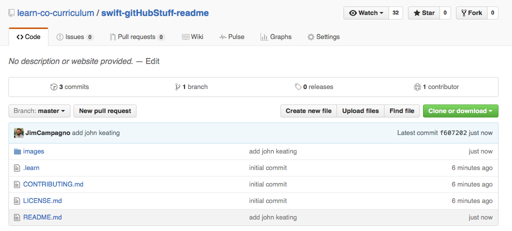
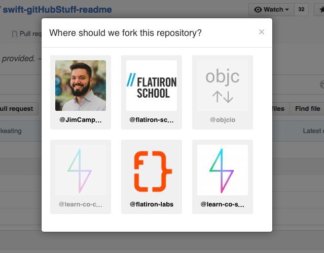
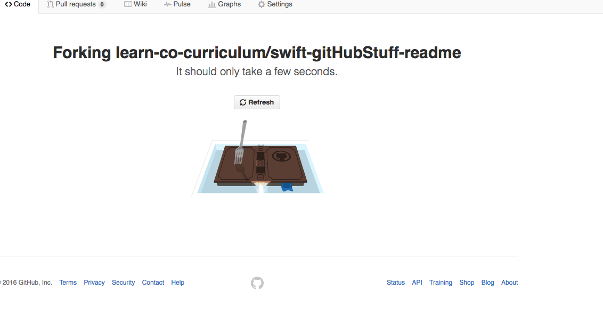
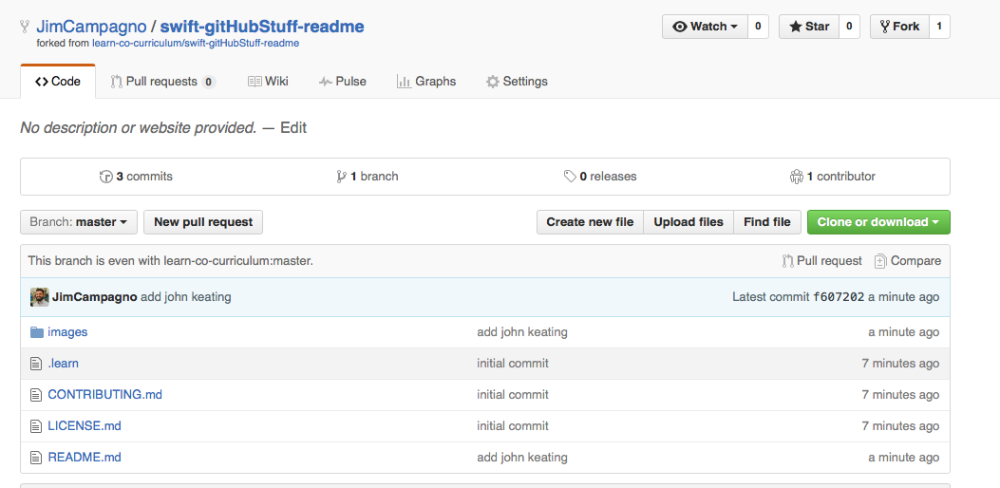
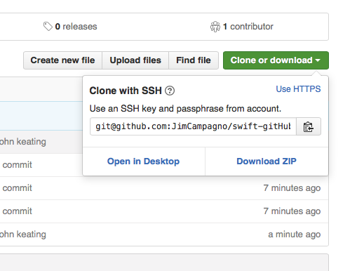
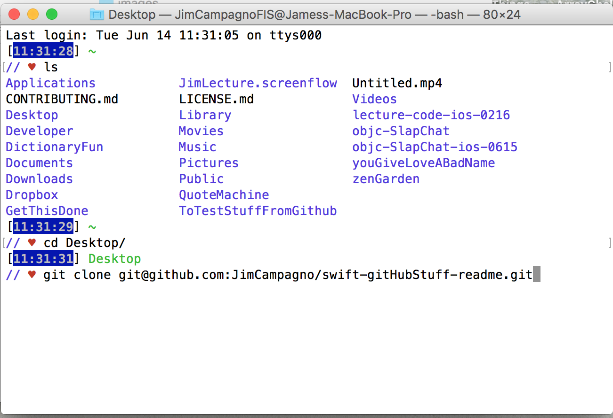

# Writing A Lab from a provided Outline


> Carpe diem. Seize the day, boys. Make your lives extraordinary. ~[John Keating](https://en.wikipedia.org/wiki/Dead_Poets_Society)

## Learning Objectives - The student should be able to..

* Code
* Code some more
* More details here

## What the student can do at this point 

* Read
* Distinguish colors
* Knows how to use print function
* More stuff here

## Outline / Notes

* My notes would go here providing more detail to how we should approach the subject.
* I might provided a narrative here to follow.
* I might include some code snippets the student should see

```swift
let name = "Jim"

print(name)
// prints "Jim"
```


---------------------------

# How to use Github from here

* From the Github Link which represents the lesson you need to write, Fork the lesson.  

  

* A menu will appear, select your Github account:



* You will be presented with a screen like this (which mean's it's forking!):



* After that completes, you will be brought to another github page which represents YOUR own copied repo which you can work in. That should look like this, notice in the top left that your name (github username) will be attached to the particular repo.



* Clone this newly forked repo to a location with the following two steps. First, copy to clipboard the address provided when you select "Clone or Download"



* Open terminal and paste that copied address as follows:



* Enter your newly created directory as follows:


* Open the readme.md file, using Markdown create an awesome Lesson!

* This work done locally (after you made a great lesson) needs to be added to github, which is done with the following commands:

```git add .``` <-- this will stage the changes  
```git commit -m "Finished Outline"``` <--- this will commit the changes with an associated message.  
``` git push``` <--- this will push the commited changes to GitHub.  

* Then create a pull request with your newly finished lab which allows us to review and make comments on the work you did.

<a href='https://learn.co/lessons/GitHubStuff' data-visibility='hidden'>View this lesson on Learn.co</a>
